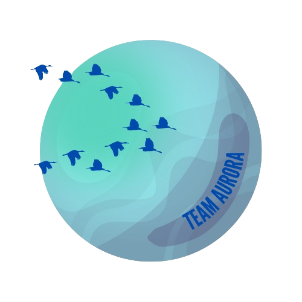
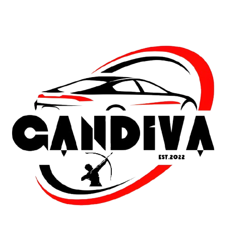
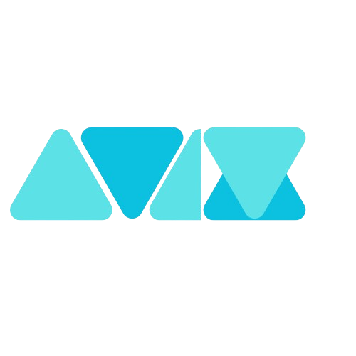

# Aravind Miras

An embedded systems engineer passionate about electric vehicles, VLSI, hardware design, and scalable real-world solutions. Skilled in embedded development, machine learning, full-stack web/mobile apps, and IoT systems.

## Tech Stack

## Featured Projects

### Smart Motor Management System (Team Aurora)

An IoT-powered motor condition monitoring system with machine learning-based predictive maintenance, real-time sensor data logging, a Flutter app, and an AR/VR-based digital twin.

---

### Solar Electric Vehicle (Team Gandiva)

A solar electric vehicle that competes in ESVC and FMAE with CAD-based chassis and thermal/impact-tested body parts. Designed with SolidWorks and ANSYS.

---

### AV10 – Agriculture Drone System

A drone-based farm monitoring system with disease detection (YOLOv8, ResNet), NDVI estimation, and an IoT ground station. Data is streamed to a Flutter app for farmers.

---

<!-- GitHub Stats (optional, can remove if you want super minimal) -->

  

---

## Contact

